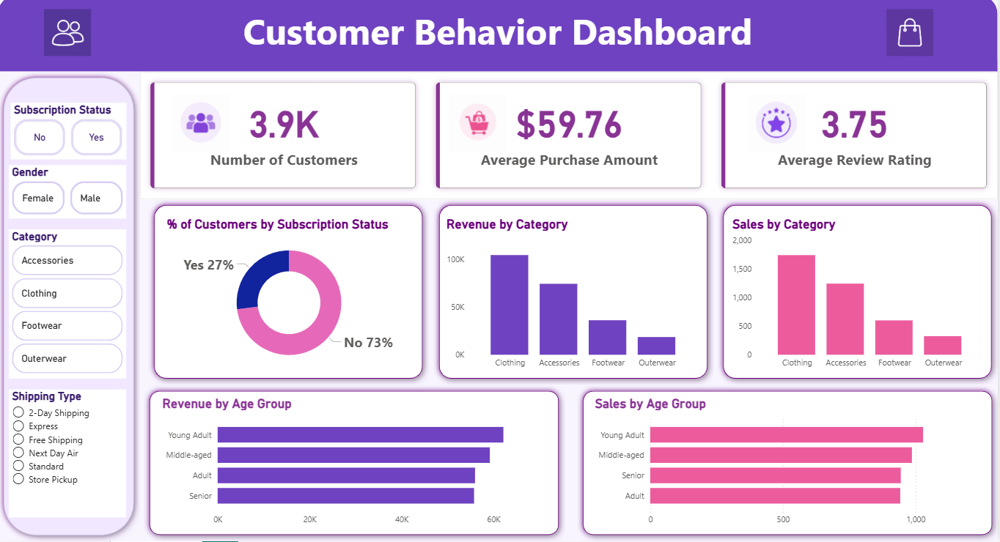

# Customer Shopping Behavior Analysis

## Project Title

**Customer Shopping Behavior Analysis | End-to-End Data Analytics Project**

This project analyzes customer shopping behavior using **Python, SQL, and Power BI** to find sales trends, customer patterns, and business recommendations.

---

## Business Problem

A retail company wants to understand customer shopping behavior to improve sales, customer satisfaction, and long-term customer loyalty.

The main business question is:

**How can the company use customer shopping data to identify trends, improve customer engagement, and optimize marketing and product strategies?**

---

## Goals

- Clean and prepare the raw dataset
- Perform Exploratory Data Analysis using Python
- Analyze business questions using SQL
- Create an interactive Power BI dashboard
- Find key customer behavior insights
- Give business recommendations to improve sales

---

## Data Source

**Source:** Kaggle  
**Dataset:** Customer Shopping Trends Dataset  
**Records:** 3,900  
**Columns:** 18  

### Dataset Information

The dataset contains customer shopping details such as:

- Customer ID
- Age
- Gender
- Item Purchased
- Category
- Purchase Amount
- Location
- Size
- Color
- Season
- Review Rating
- Subscription Status
- Shipping Type
- Discount Applied
- Promo Code Used
- Previous Purchases
- Payment Method
- Frequency of Purchases

---

## Tools Used

| Tool | Purpose |
|---|---|
| Python | Data cleaning and EDA |
| Pandas | Data manipulation |
| SQL / PostgreSQL | Business analysis |
| Power BI | Dashboard creation |
| DAX | KPI calculations |
| GitHub | Project documentation |

---

## Exploratory Data Analysis

EDA was performed using Python to understand the dataset and identify patterns.

### EDA Steps

- Loaded the dataset
- Checked rows and columns
- Checked missing values
- Filled missing review ratings
- Checked duplicate values
- Analyzed numerical and categorical columns
- Created age groups
- Analyzed revenue, sales, ratings, and customer segments

### Important EDA Questions

- What is the total number of customers?
- What is the average purchase amount?
- What is the average review rating?
- Which category generates the highest revenue?
- Which age group contributes the most revenue?
- How does subscription status affect customer behavior?
- Which shipping type is most used?

---

## SQL Analysis

SQL was used to answer business questions from the cleaned dataset.

### SQL Analysis Performed

- Revenue by gender
- Revenue by product category
- Sales count by category
- Average purchase amount by shipping type
- Top-rated products
- Discount usage analysis
- Subscription status analysis
- Customer segmentation
- Revenue by age group
- Repeat purchase behavior

### Sample SQL Query

```sql
SELECT 
    category,
    SUM(purchase_amount) AS total_revenue
FROM customer_shopping_behavior
GROUP BY category
ORDER BY total_revenue DESC;
```
## Power BI Dashboard



## Key Insights

- Clothing generates highest revenue and sales
- Most customers are non-subscribers
- Young Adult customers contribute most revenue
- Average purchase amount is $59.76
- Average review rating is 3.75

## Recommendations

- Focus on Clothing category
- Increase subscription conversion
- Target Young Adult customers
- Improve product quality
- Use personalized marketing
- Build loyalty programs

## Final Conclusion

This project shows how customer shopping data can be used to understand behavior, improve marketing strategies, and increase sales.

Clothing, Young Adult customers, and subscription programs are key drivers for business growth.


